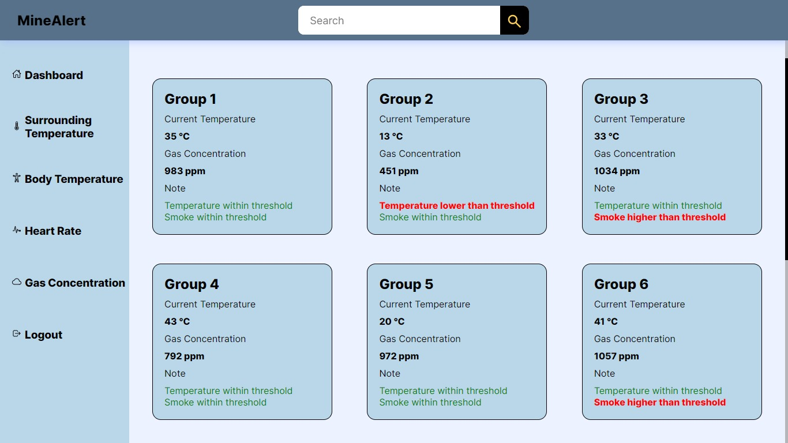

## ⚒️ Mine Alert

**Project Description:**
Mine Alert is a real-time monitoring system designed to enhance worker safety in underground mining environments. It utilizes sensors mounted on miners' equipment to collect vital data points like heart rate, surrounding temperature, and gas concentration. This data is then transmitted wirelessly, analyzed, and displayed on a central dashboard, allowing for immediate intervention in case of potential hazards.

**Key Features:**

* **Sensor Data Acquisition:** The system gathers real-time sensor data from various sensors (e.g., heart rate monitors, temperature sensors, gas detectors) worn by miners.

* **Data Transmission:** Utilizing a reliable wireless network (e.g., Wi-Fi, LoRaWAN), the sensor data is transmitted to a central server for processing.

* **Data Analysis and Visualization:** Collected data is processed in real-time to identify potential safety risks. This processed data is then presented on a user-friendly dashboard with clear manner and visualization, enabling quick and informed decision-making.

* **Alert Generation:** When sensor readings exceed pre-defined thresholds (can be changed), the system triggers alarms on the dashboard and sends push notifications.

**Images**

 
 
 
 
 
 

